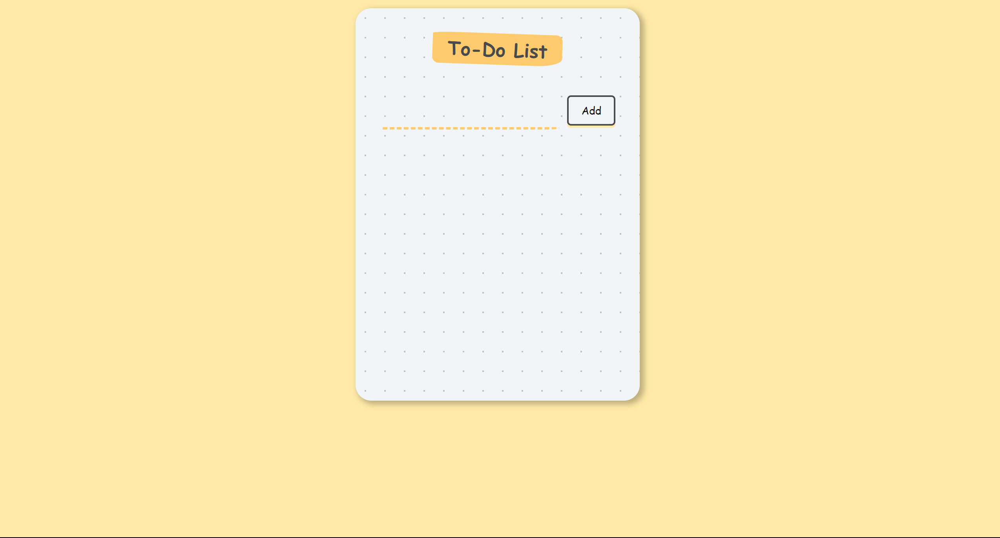

# Todo List App using React

This is a simple Todo List application built using React. It allows users to create, manage, and track their tasks in a convenient and organized manner.



## Table of Contents

- [Features](#features)
- [Installation](#installation)
- [Usage](#usage)
- [Contributing](#contributing)

## Features

- Add new tasks with a title and optional description.
- Mark tasks as complete or incomplete.
- Delete tasks that are no longer needed.
- Filter tasks by their completion status (all, completed, incomplete).
- Responsive design for seamless use on various devices.

## Installation

Follow these steps to set up and run the Todo List app on your local machine:

1. **Clone the repository:**

   ```bash
   git clone https://github.com/nishujangra/ToDo-List-React.git
   ```

2. **Navigate to the project directory:**

   ```bash
   cd todo-list-react
   ```

3. **Install dependencies:**

   ```bash
   npm install
   ```

## Usage

1. **Start the development server:**

   ```bash
   npm start
   ```

   This will launch the app in your default web browser. You can access it at [http://localhost:3000](http://localhost:3000).

2. **Add a new task:**

   - Enter the title and optional description for the task in the input fields.
   - Click the "Add Task" button.

3. **Manage tasks:**

   - To mark a task as complete, click the checkbox next to it.
   - To mark a task as incomplete, click the checkbox again.
   - To delete a task, click the "Delete" button next to it.

4. **Responsive design:**

   The app is designed to work well on various screen sizes, including desktop, tablet, and mobile devices.

## Contributing

Contributions are welcome! If you'd like to contribute to the project, please follow these steps:

1. Fork the repository.
2. Create a new branch for your feature or bug fix: `git checkout -b feature-name`.
3. Make your changes and commit them with a descriptive commit message.
4. Push your changes to your fork: `git push origin feature-name`.
5. Submit a pull request detailing your changes and their purpose.

Please ensure your code follows the existing coding style and conventions.

---

Feel free to customize this Readme file to suit your project's specific needs. Good luck, and happy coding!